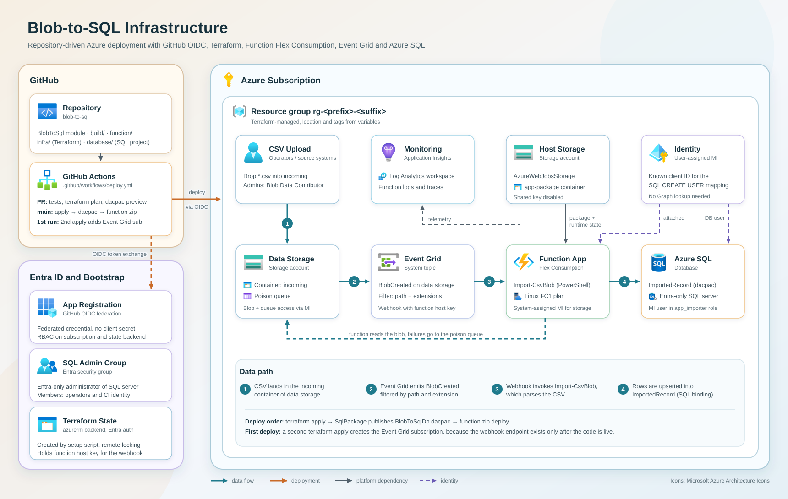

# BlobToSql: CSV blob → Azure Function (PowerShell, Flex Consumption) → Azure SQL

A CSV file lands in the `incoming` container. Event Grid calls the function. The function parses the file and upserts the rows into `dbo.ImportedRecord`. All authentication uses the Function App's system-assigned managed identity. There are no keys or passwords.



```
Storage (data) --BlobCreated *.csv--> Event Grid system topic --webhook--> Import-CsvBlob (blobTrigger, source=EventGrid)
                                                                               |
                                                                               +--SQL output binding (MERGE)--> Azure SQL
```

The project is scaffolded from the PSModuleDevelopment `AzureFunction` template (v2.0.6, `development` branch). The template has no blob trigger kind, so this project adds one (see [Changes to the template](#changes-to-the-template)).

## Layout

| Path | Content |
| --- | --- |
| `BlobToSql/functions/blobTrigger/Import-CsvBlob.ps1` | The endpoint. Bytes in, row objects out. |
| `BlobToSql/internal/scripts/schema.ps1` | Column definitions (name, type, required). |
| `BlobToSql/internal/functions/` | Delimiter detection, value conversion. |
| `build/build.config.psd1` | `FlexConsumption = $true`, `BlobTrigger` section (path, connection, SQL output). |
| `build/functionBlob/` | Wrapper `run.ps1` + `function.json` template for blob endpoints. |
| `function/` | host.json, profile.ps1, requirements.psd1 (template defaults). |
| `infra/` | Terraform (azurerm 5.x), `env/prod.tfvars` for CI, `backend.hcl.example` for local runs. |
| `assets/` | Architecture diagram. |
| `../.github/workflows/csv-upload-to-azure-sql.yml` | GitHub Actions in the BlogAssets root: plan on PR, deploy on `main`. |
| `database/BlobToSqlDb/` | SQL database project (Microsoft.Build.Sql): table, role, grants, post-deployment script. Builds to a `.dacpac`. |
| `scripts/` | Database publish, one-time GitHub/Azure setup, CI helpers. |
| `tests/` | Sample CSVs and a local test runner. |

## CSV format

```csv
MeasuredAt;DeviceId;Value
25.09.2026 08:00;sensor-01;21,5
2026-09-25T08:05:00Z;sensor-02;1.234,75
```

- **Columns are matched by header name.** Column order doesn't matter. Extra columns are ignored with a warning. Missing required columns fail the file.
- **Delimiter** `auto` detects `;`, `,` or tab from the header line. Quoted fields (`"a;b"`) work.
- **Encoding** is `utf-8` by default, with or without BOM. Use `windows-1252` for classic Excel "CSV (Trennzeichen-getrennt)" exports.
- **Decimals.** `21.5`, `21,5`, `1.234,75` and `1,234.75` all work, because the last separator is taken as the decimal separator. This makes `1,234` ambiguous: it is read as 1.234.
- **Timestamps.** ISO 8601 and `dd.MM.yyyy [HH:mm[:ss]]` are supported. Values with `Z` or an offset are converted to UTC. Values without an offset are read in `CSV_SOURCE_TIMEZONE` (default `UTC`) and stored as UTC.
- **All or nothing.** Any invalid value fails the whole file and nothing is written. After the retries the blob goes to the `webjobs-blobtrigger-poison` queue in the data storage account.
- **Idempotent.** The primary key is (`SourceBlob`, `RowNumber`), and the SQL binding does a MERGE. Processing a file twice updates the rows. This matters because Event Grid delivers at least once.

To change the columns, edit `schema.ps1` and `database/BlobToSqlDb/dbo/Tables/ImportedRecord.sql` together.

## Deploy with GitHub Actions

The workflow is [`.github/workflows/csv-upload-to-azure-sql.yml`](../.github/workflows/csv-upload-to-azure-sql.yml) in the root of the BlogAssets repository, because GitHub only runs workflows from there. It runs every step inside this folder and only triggers on changes to this folder or to the workflow itself. It authenticates with OIDC (federated credentials), so there are no client secrets.

To use the project in a repository of its own, copy this folder as the repository root, move the workflow to `.github/workflows/`, and remove the `paths` filters and the folder name from `working-directory` and `POST_DIR`.

| Trigger | Jobs |
| --- | --- |
| Pull request to `main` | Parser tests, function package build, dacpac build, `terraform fmt/validate/plan`, and the T-SQL a database publish would run. Both previews go to the job summary. |
| Push to `main`, manual run | Tests + builds, then **Deploy** (GitHub environment `csv-upload-to-azure-sql`): `terraform apply`, dacpac publish, function code publish, and on the first run a second apply for the Event Grid subscription. |

The deploy job handles the chicken-and-egg problem with Event Grid on its own. It checks whether `Import-CsvBlob` is already deployed. On the first run it creates the infrastructure without the subscription, publishes the code, waits until the function is listed, and then creates the subscription. On later runs the subscription stays in place.

For SQL, the job opens a firewall rule for the runner's IP, runs `Publish-Database.ps1` (SqlPackage), and removes the rule again (also on failure). The dacpac is built once in the test job and passed on as an artifact, so the same build is previewed and deployed.

### One-time setup

Run this once with an account that is Owner on the subscription and can create Entra apps and groups:

```powershell
Connect-AzAccount -Tenant <tenant>.onmicrosoft.com
gh auth login   # only for -ConfigureGitHub
./scripts/New-GitHubDeploymentIdentity.ps1 -Repository '<owner>/BlogAssets' -SubscriptionId '<subscription-id>' `
    -AppName 'gh-blob-to-sql-deploy' -SqlAdminGroupName 'sg-blob-to-sql-sql-admins' -ConfigureGitHub
```

It creates or reuses:

1. **Resource providers.** Microsoft.Web, Storage, Sql, EventGrid, Insights, OperationalInsights and ManagedIdentity. azurerm 5.x no longer registers providers automatically.
2. **App registration + service principal** named by `-AppName` (default `gh-<repo>-deploy`), with no secret.
3. **Federated credentials** for `environment:csv-upload-to-azure-sql` (deploy) and `pull_request` (plan). Repositories created after 2026-07-15 use GitHub's immutable subject (`repo:owner@<id>/repo@<id>:...`). The script picks the format from the repository's creation date. Use `-SubjectFormat Immutable` if you opted an older repository in.
4. **RBAC on the subscription.** The service principal gets `Contributor`, plus `Role Based Access Control Administrator` with a condition. The condition only lets it assign or remove the three storage data roles the Terraform code uses.
5. **Terraform state.** Resource group `rg-tfstate` with a storage account that uses Entra ID auth only and has versioning and 30-day soft delete. The service principal and you get `Storage Blob Data Contributor` on it.
6. **SQL admin group** named by `-SqlAdminGroupName` (default `sg-<repo>-sql-admins`), with the service principal and you as members.
7. **GitHub** (with `-ConfigureGitHub`): the repository variables `AZURE_*`, `TFSTATE_*` and `SQL_ADMIN_GROUP_*`, plus the `csv-upload-to-azure-sql` environment. Add required reviewers to that environment if you want an approval gate before apply. The variables are repository-wide, so they are shared with any other workflow in BlogAssets.

The script is idempotent. Run it again to fill in anything missing.

Then commit `.terraform.lock.hcl`. Run `terraform init -backend-config=backend.hcl` once locally to create it.

### Why a user-assigned identity for SQL

The pipeline runs as a service principal. If a service principal runs `CREATE USER ... FROM EXTERNAL PROVIDER`, the SQL server's own identity needs the Entra **Directory Readers** role, which is a tenant-level grant. Instead, the database user is created with `WITH SID = <client id>, TYPE = E`, which skips the directory lookup. That needs the identity's client ID in Terraform. For a system-assigned identity, the client ID is only available through Microsoft Graph, so the Function App got a user-assigned identity for SQL. Storage still uses the system-assigned identity.

### Security notes

- **PR plans use the same service principal as the deploy job.** Fork PRs don't get an OIDC token, but anyone who can push a branch to the repository can run the plan job. Protect `main`, and keep write access to the repository tight. For stricter separation, create a second app with `Reader` + state access for the `pull_request` subject.
- **The subscription-level Contributor role** exists because Terraform creates the resource group. To narrow it, pre-create the resource group and scope the roles to it.
- **Terraform state contains the blob extension key.** The state storage account allows Entra ID auth only.

## Deploy manually

Prereqs: PowerShell 7, Terraform ≥ 1.9, Azure CLI, the .NET 8+ SDK, SqlPackage (`dotnet tool install -g microsoft.sqlpackage`) and `Az.Accounts`. Run `New-GitHubDeploymentIdentity.ps1` first (without `-ConfigureGitHub`, if you don't use GitHub). It creates the state storage and the SQL admin group.

```powershell
# 0. Local test (no Azure needed)
./tests/Invoke-LocalTest.ps1

# 1. Infrastructure (no Event Grid subscription yet)
cd infra
Copy-Item backend.hcl.example backend.hcl                # values from the setup script
Copy-Item terraform.tfvars.example terraform.tfvars      # fill it in (SQL admin group, your IP)
terraform init -backend-config=backend.hcl
terraform apply

# 2. Database schema (builds the dacpac, then publishes it)
#    Needs the .NET 8+ SDK and: dotnet tool install -g microsoft.sqlpackage
../scripts/Publish-Database.ps1 `
  -SqlServerFqdn    (terraform output -raw sql_server_fqdn) `
  -Database         (terraform output -raw sql_database) `
  -IdentityName     (terraform output -raw sql_identity_name) `
  -IdentityClientId (terraform output -raw sql_identity_client_id)

# 3. Build + publish (template build script; uses az CLI because FlexConsumption = $true)
../build/build.ps1 -AppRg (terraform output -raw resource_group) -AppName (terraform output -raw function_app_name)

# 4. Event Grid subscription (the webhook must exist to pass validation)
terraform apply -var enable_event_subscription=true

# 5. Test
az storage blob upload --auth-mode login `
  --account-name (terraform output -raw data_storage_account) `
  -c incoming -f ../tests/sample-semicolon.csv -n sample.csv
```

## Database project

`database/BlobToSqlDb` is an SDK-style SQL project (`Microsoft.Build.Sql` 2.3.0, target platform Azure SQL Database). `dotnet build` compiles it to `BlobToSqlDb.dacpac` and runs the static code analysis. SqlPackage compares the dacpac with the live database and applies the difference.

| File | Content |
| --- | --- |
| `dbo/Tables/ImportedRecord.sql` | The table, declared as a plain `CREATE TABLE`. SqlPackage generates the `ALTER`s. |
| `Security/app_importer.sql` | Role `app_importer` with `SELECT, INSERT, UPDATE` on that table only. This is what the MERGE of the SQL output binding needs. |
| `Scripts/PostDeployment.sql` | Creates the managed identity user (`WITH SID = <client id>, TYPE = E`) and adds it to `app_importer`. Idempotent. It also removes the old `db_datareader`/`db_datawriter` memberships from earlier versions of this project. |
| `BlobToSqlDb.publish.xml` | Publish options, used locally and in CI. |

The user and role membership are the only environment-specific parts, so they are not in the model. They come in through the SqlCmd variables `IdentityName` and `IdentityClientId`, and the post-deployment script applies them.

Publish options:

- `BlockOnPossibleDataLoss=True`: a change that would drop a column or narrow a type stops the deployment. For such changes, write a pre-deployment script that migrates the data first.
- `DropObjectsNotInSource=False`: objects that exist in the database but not in the project are left alone. Set it to `True` if the project should be the only source of truth.
- `ExcludeObjectTypes=Users;Logins;RoleMembership`: SqlPackage never touches users or memberships. The post-deployment script owns them.
- `ScriptDatabaseOptions=False`: database settings (SKU, size and so on) stay with Terraform.

Workflow for a schema change: edit the `.sql` file, open a PR, and review the generated T-SQL in the job summary. Merging to `main` deploys it.

Local preview without changing anything:

```powershell
../scripts/Publish-Database.ps1 -Action Script -OutputPath ./db-changes.sql -SqlServerFqdn ... -Database ... -IdentityName ... -IdentityClientId ...
```

## Changes to the template

1. **New trigger kind `blobTrigger`.** This adds `build/functionBlob/*`, a `BlobTrigger` section in `build.config.psd1`, and a matching region in `build.ps1` and `psf-build.ps1`. The wrapper passes `-InputBlob`, `-BlobName` and `-TriggerMetadata` only when the command declares them. It pushes the command output to the SQL output binding and rethrows errors, so the runtime retries and poisons the blob.
2. **`FlexConsumption = $true`.** The build then disables managed dependencies in host.json.
3. **`function/modules` renamed to `function/Modules`.** The PowerShell worker adds `<app root>/Modules` to `PSModulePath`, and Flex runs on Linux, so the folder name is case-sensitive. If you build on Windows, the zip ends up with a lowercase `modules` folder and the module is not found at runtime.
4. **`build.ps1` path fix.** `Modules/<name>/Functions` changed to `functions`. On Linux or macOS build agents the capital `F` made `FunctionsToExport` empty.
5. **Publish on Flex uses `az functionapp deployment source config-zip`.** `Publish-AzWebApp` is not a documented deployment method for Flex Consumption.
6. **`Azure.Function.Tools` commented out** in `requirements.psd1`. Only the http and eventGrid wrappers need it.
7. **Typo fix** (`EventGridTrFigger`) in the Event Grid region.

Not changed, but worth knowing: the template's `eventGridTrigger` wrapper looks copied from the http one. Its `run.ps1` reads `$Request`, which is never set (the parameter is `$EventGridEvent`). Its `function.json` has `authLevel`, `methods` and an `http` output, which an `eventGridTrigger` doesn't use. That's why this project uses the blob trigger instead.

## Notes

- **`AzureWebJobsStorage = ""`** in Terraform works around azurerm provider issue #29693. With managed-identity storage, the provider still writes a key-based value. Microsoft's Flex Terraform sample uses the same workaround.
- **SQL network.** `AllowAzureServices` (0.0.0.0) is there because Flex has no fixed outbound IPs without VNet integration. For production, use VNet integration and a private endpoint.
- **Role propagation.** New role assignments can take a few minutes, so the first invocations may fail and then succeed on retry.
- **Serverless SQL** (`GP_S_Gen5_*`) auto-pauses. The first write after a pause can fail with error 40613 and then succeed on retry.

---

## Template Instructions (from PSModuleDevelopment)

### Layout

There are three folders with this project:

+ build: Where all the magic happens - do not touch, other than the config file (`build.config.psd1`)
+ function: Where the basic function app files are stored. Generally you only need to update the `requirements.psd1` for Managed Dependencies (do not use when running on Flex Consumption plan)
+ `<name>`: Folder with the PowerShell module that gets turned into a function app. This is where you add your content, usually.

### Flex Consumption and You

If you plan to deploy the function app code to an App running under the Flex Consumption plan, **you must configure the template for it!**
Not all features are available in that plan - specifically the Managed Dependencies feature does not work - and that changes the requirements we have to work with.

To make things work, open the project configuration file: `build\build.config.psd1`.
Enable the Flex Consumption behavior by setting `General > FlexConsumption` to `$true`.

### Adding your content

Your own code is usually placed in the `<name>` root level folder, which is a regular, lightweight PowerShell module structure.
Treat it as a module and add code as you would for a module.

Any RequiredModules you declare will automatically be downloaded and bundled with the function app during build.

There _is_ however one special aspect:
In the `functions` subfolder you will find several subfolders, that are special to this template:

+ `<name>/functions/eventGridTrigger`
+ `<name>/functions/httpTrigger`
+ `<name>/functions/nonPublished`
+ `<name>/functions/timerTrigger`

Functions placed in a particular trigger-folder will be published as that kind of trigger within the function app.
For example, if you place a `Get-EntraUser.ps1` file & PS-function under the `httpTrigger` subfolder, your function-app will have an http endpoint with the url `<function-app-baseurl>/api/Get-EntraUser` that accepts the same parameters (via body or query) as the PS-function you wrote.

The same applies to the other trigger kinds (though a Timer Trigger cannot receive any parameters, even if you add them to the PS-function).

> Configuring Details

Having the triggers generated automatically is all nice and useful, but some triggers might need some extra configuration.
For example, when defining a timer trigger, what is the actual schedule it triggers on?

All those configuration aspects can be found under `build/build.config.psd1`.
For each setting you can define a global default and overrides for specific, individual endpoints.
The individual settings and what they mean are documented in that file.
