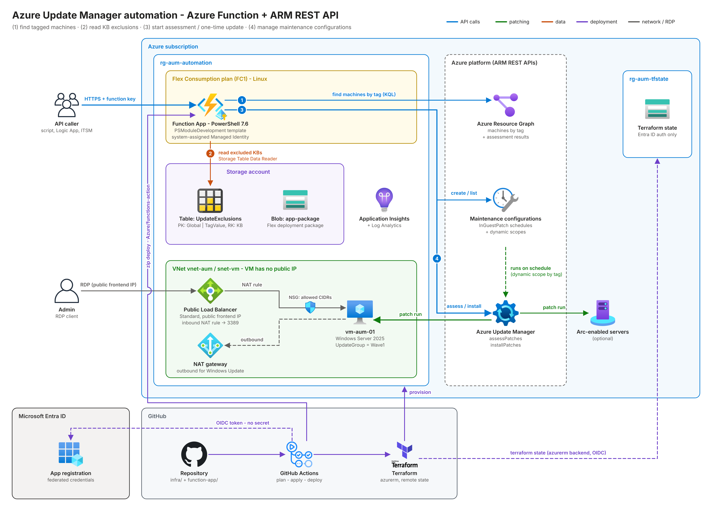

# AzureUpdateManagerAutomation

Drive **Azure Update Manager** through HTTP calls to an **Azure Function** (PowerShell, Flex Consumption).
The functions use plain **ARM REST API** calls with the Function App's **Managed Identity** - no Az module, no secret.
Everything is deployed with **Terraform** and **GitHub Actions** (OIDC).



## Endpoints

| Endpoint | Method | What it does |
|---|---|---|
| `/api/Start-UpdateAssessment` | POST | "Check for updates" on all machines with a tag (`assessPatches`) |
| `/api/Start-OneTimeUpdate` | POST | One-time update on all machines with a tag (`installPatches`). Excluded KBs come from Azure Table Storage |
| `/api/New-UpdateMaintenanceConfiguration` | POST | Create/update a maintenance configuration (scheduled patching), optional dynamic scope by tag |
| `/api/Get-UpdateMaintenanceConfiguration` | GET/POST | List maintenance configurations incl. dynamic scopes |
| `/api/Get-UpdateManagerMachine` | GET/POST | List all Azure VMs + Arc-enabled servers with their latest assessment |

Parameters go into the JSON body or the query string (lists: JSON array or comma separated).
Auth level: `function` (send `x-functions-key`).

## Exclusion table (`UpdateExclusions`)

| PartitionKey | RowKey | Title | Reason | Enabled | ExpiresOn |
|---|---|---|---|---|---|
| `Global` | `KB5122871` | 2026-09 Security Update for Windows Server 2025 | Example: RDS BUG | `true` | optional |
| `Wave1` | `KB890830` | ... | ... | `true` | optional |

Terraform seeds the first row (`sample_exclusions` in `infra/variables.tf`). The second row is an example for a group-specific exclusion.

`Global` applies to every run. Any other partition applies to machines whose tag value matches it.
`Enabled = false` or a past `ExpiresOn` disables a row without deleting it.

## Repository layout

The paths below are relative to this project folder. The workflow lives in the repository root, because GitHub only reads `.github/workflows` there.

```
<repository root>/.github/workflows/serverless-on-demand-patching-aum.yml
                                 plan -> build -> apply -> deploy (runs only for changes in this folder)

docs/                            architecture.png / .svg (docs/architecture.py renders them)
function-app/                    generated with PSModuleDevelopment's AzureFunction template
  build/                         build.ps1, psf-build.ps1 (used by the workflow), build.config.psd1 (FlexConsumption = $true),
                                 trigger templates (functionHttp, functionTimer, functionEventGrid)
  function/                      host.json, profile.ps1, requirements.psd1, Modules/
  UpdateManagerAutomation/
    functions/httpTrigger/       one file = one HTTP endpoint
    internal/functions/          REST helpers (token, ARM, Resource Graph, Table Storage)
infra/                           Terraform (RG, VNet + NSG + NAT gateway + public load balancer for RDP, sample VM, storage + table, Log Analytics,
                                 Application Insights, Flex Function App, custom role)
scripts/
  New-GitHubOidcDeploymentIdentity.ps1   one-time bootstrap: Entra app + federated credentials + tfstate storage + RBAC
  Invoke-UpdateManagerFunction.ps1       test client
  Remove-AumDeployment.ps1               removes everything again: Azure, Entra ID, Terraform state, GitHub
```

## Prerequisites

- PowerShell 7.2 or later with the Az modules `Az.Accounts`, `Az.Resources` and `Az.Storage`
- GitHub CLI (`gh`), signed in: needed for `-ConfigureGitHub`, `-ResolveGitHubId` and `Remove-AumDeployment.ps1`
- Subscription Owner (or User Access Administrator + Contributor) and the right to create app registrations

## Getting started

1. Put this folder into a GitHub repository (here: a folder of the `BlogAssets` repository) and push it.
2. Bootstrap (once, as subscription Owner):
   ```powershell
   Connect-AzAccount
   $identity = @{
       GitHubOrganization = '<org>'
       GitHubRepository   = '<repo>'
       ResolveGitHubId    = $true   # only if the OIDC subject contains the immutable owner and repository ID
       ConfigureGitHub    = $true
   }
   ./scripts/New-GitHubOidcDeploymentIdentity.ps1 @identity
   ```
   Without `ResolveGitHubId` the federated credentials use the name-based subject `repo:<org>/<repo>:...`.
   If the sign-in fails with `AADSTS700213`, the repository uses immutable IDs: run the script again with `ResolveGitHubId`.
3. Run the workflow (push to `main` or *Run workflow*). It plans, builds `Function.zip`, applies Terraform and deploys the code.
   A pull request only runs `terraform plan` and the build; apply and deploy run on `main`.
4. Call it:
   ```powershell
   $call = @{
       FunctionAppName   = '<name>'
       ResourceGroupName = 'rg-aum-automation'
       Endpoint          = 'Start-OneTimeUpdate'
       Parameters        = @{ TagName = 'UpdateGroup'; TagValue = 'Wave1' }
   }
   ./scripts/Invoke-UpdateManagerFunction.ps1 @call
   ```

## Sample VM access

The sample VM still has no public IP. Terraform publishes RDP through a
Standard public load balancer NAT rule on `var.rdp_frontend_port`
(default `3389`) and opens the subnet NSG only for
`var.rdp_allowed_source_cidrs` (default `["*"]`; restrict this in real
deployments).

```powershell
terraform output -raw sample_vm_rdp_host
terraform output -raw sample_vm_rdp_username
terraform output -raw sample_vm_rdp_password
```

## Remove everything

```powershell
Connect-AzAccount
$cleanup = @{ GitHubOrganization = '<org>'; GitHubRepository = '<repo>' }
./scripts/Remove-AumDeployment.ps1 @cleanup -WhatIf   # preview
./scripts/Remove-AumDeployment.ps1 @cleanup            # asks before every step
```

It deletes the workload resource group, the custom role, the Entra app registration, the Terraform state storage, all workflow runs, the GitHub environment and the repository variables (only if they belong to this deployment). Resource provider registrations stay.

## Local build

```powershell
./function-app/build/psf-build.ps1   # creates function-app/Function.zip (same script as the workflow)
```

`psf-build.ps1` bootstraps PSFramework.NuGet and saves the modules with `Save-PSFModule`; `build.ps1` does the same with `Save-Module`.
Both scripts build paths with backslashes, so the workflow builds on `windows-latest`.
The Function App itself runs on Linux, where paths are case-sensitive.
That is why the template folder `function/modules` was renamed to `function/Modules`: the build saves the bundled modules to `Modules`, and the Functions host only loads `<app root>/Modules`.